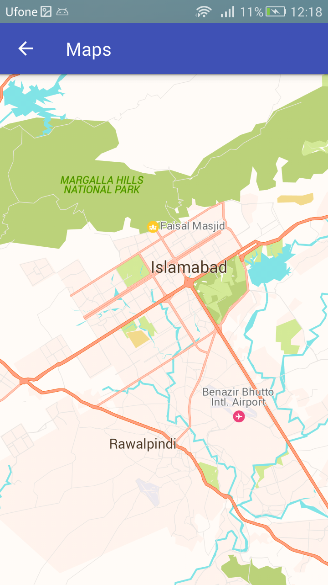
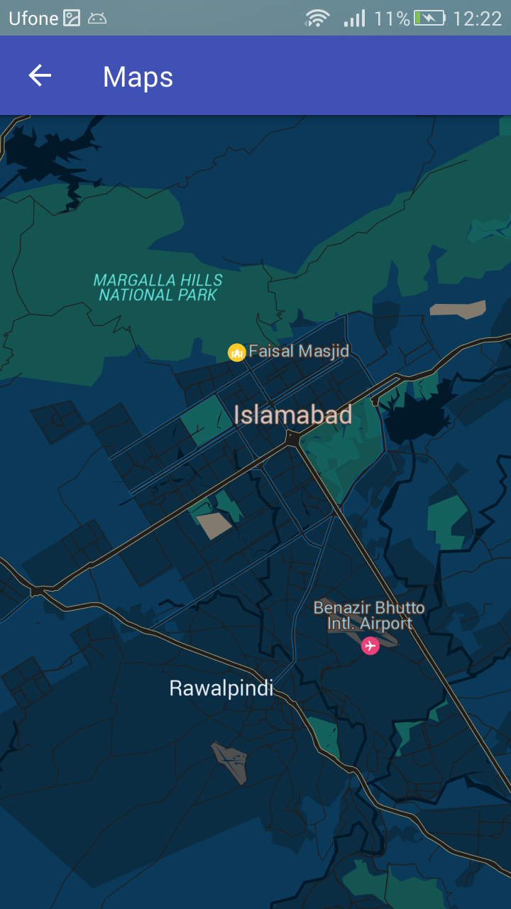
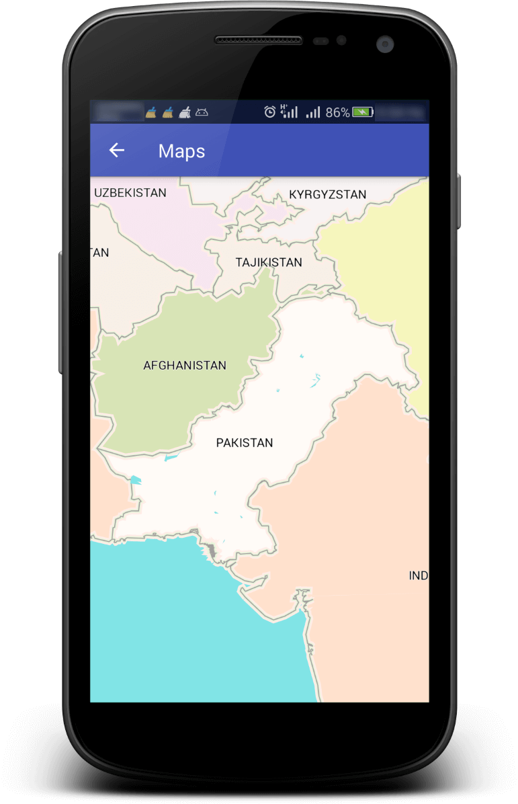

# Table Of Content
- [Maps API](#maps-api)
  * [Overview](#overview)
  * [Getting Started](#getting-started)
    + [Step 1. Download Android Studio](#step-1-download-android-studio)
    + [Step 2. Create TPL Maps application project](#step-2-create-tpl-maps-application-project)
    + [Step 3. Configure API key](#step-3-configure-api-key)
    + [Step 4. Setup map in your application](#step-4-setup-map-in-your-application)
    + [Step 5. Connect an Android device](#step-5-connect-an-android-device)
    + [Step 6. Build and run your app](#step-6-build-and-run-your-app)
    + [Next steps](#next-steps)
  * [Setup Maps](#setup-maps)
  * [Map Objects](#map-objects)
  * [The map object](#the-map-object)
    + [MapView](#mapview)
  * [Map Mode](#map-mode)
    + [Default (Day)](#default--day-)
    + [Night](#night)
    + [Change the map mode](#change-the-map-mode)
  * [Configure maps state](#configure-maps-state)
    + [Programmatically](#programmatically)
      - [Configure Map Mode](#configure-map-mode)
      - [Configure Camera Position](#configure-camera-position)
      - [Configure Map UI Settings](#configure-map-ui-settings)
      - [Configure Map Layers](#configure-map-layers)
  * [Enable Location on map](#enable-location-on-map)
    + [Example Screen](#example-screen)
  * [Draw markers and shapes](#draw-markers-and-shapes)
    + [Marker](#marker)
    + [Polyline](#polyline)
    + [Polygon](#polygon)
    + [Circle](#circle)
  * [Markers and shapes Events](#markers-and-shapes-events)
  * [Add Style Map JSON Formatted](#add-style-map-json-formatted)
    + [featureType](#featuretype)
    + [styler](#styler)
  * [Sample JSON](#sample-json)
  * [Proguard](#proguard)
  * [API Documentation](#api-documentation)
  * [Screenshot](#screenshot)

# Maps API

## Overview

TPL Maps Android API provides help to add maps to your application. The API automatically handles access to our TPL Maps servers, data downloading, map display, and response to map gestures. You can do add markers, shapes, show/hide 3D buildings, show/hide point of interests, custom map styles and much more.

## Getting Started

This guide is a quick start to adding a map to an Android app. [Android Studio](http://developer.android.com/tools/studio/index.html) is the recommended development environment for building an app with the TPL Maps Android SDK.

### Step 1. Download Android Studio

Follow the guides to [download](https://developer.android.com/sdk/index.html) and [install](http://developer.android.com/sdk/installing/index.html?pkg=studio) Android Studio.

### Step 2. Create TPL Maps application project

Follow these steps to create a new app project including a map activity:

1. Start Android Studio.

2. Create a new project as follows:

   a. If you see the **Welcome to Android Studio** dialog, choose **Start a new Android Studio project**, available under 'Quick Start' on the right of the dialog.

   b.   Otherwise, click **File** in the Android Studio menu bar, then **New**, **New Project**.

3. Enter your app name, company domain, and project location, as prompted. Then click **Next**.

4. Select the form factors you need for your app. If you're not sure what you need, just select **Phone and Tablet**. Then click **Next**.

5. Select **Empty Activity** in the 'Add an activity to Mobile' dialog. Then click **Next**.

6. Enter the activity name **‘ActivityMaps’**, layout name **‘layout_maps.xml’** and title as prompted. Then click **Finish**.

Android Studio starts Gradle and builds your project. This may take a few seconds. For more information about creating a project in Android Studio, see the [Android Studio documentation](https://developer.android.com/sdk/installing/create-project.html).

When the build is finished, Android Studio opens the layout_tpl_maps.xml and the ActivityTPLMaps.java files in the editor. *(Note that your activity may have a different name, but it will be the one you configured during setup)*. The next section describes getting the API key in more detail.

### Step 3. Configure API key & ORIGIN

Create an account on [TPLMaps LBS Portal](https://api.tplmaps.com/apiportal).

Get the Key (without **ORIGIN**), from your **Dashboard**, find **API Keys** Tab and [Generate New Key](https://api.tplmaps.com/apiportal/#/app/billing/api-key-management) from the option. 

Copy the key put it into `meta-tag` mentioned below and copy the tag in your project’s **AndroidManifest.xml** under `<application>` tag

```xml
<meta-data android:name="com.tplmaps.android.sdk.API_KEY"
           android:value="YOUR_API_KEY_HERE" />
```
If you generate **API Key** with the **ORIGIN** mentioned, you must need to add the ORIGIN in **AndroidManifest.xml** in the tag mentioned below with API Key.

> The tag below is **optional** for non-origin based API Key.

```xml
<meta-data android:name="com.tplmaps.android.sdk.ORIGIN"
           android:value="YOUR_ORIGIN_HERE" />
```

### Step 4. Setup map in your application

For setting map in your android application, you need to follow the instructions given in [Setup Map](#setup-maps) section of this document

### Step 5. Connect an Android device

The simplest way to see your app in action is to connect an Android device to your computer. Follow the [instructions](http://developer.android.com/tools/device.html) to enable developer options on your Android device and configure your application and system to detect the device.

Alternatively, you can use the Android Emulator to run your app. Use the [Android Virtual Device (AVD) Manager](http://developer.android.com/tools/devices/managing-avds.html) to configure one or more virtual devices which you'll be able to use with the Android Emulator when you build and run your app. When choosing your emulator, ensure that you use Android 4.2.2 or higher, and be careful to pick an image that includes the Google APIs, or the application will not have the requisite runtime APIs in order to execute. Also, take note of the instructions for [configuring virtual machine acceleration](http://developer.android.com/tools/devices/emulator.html#accel-vm), which you should use with an **x86 target AVD** as described in the instructions. This will improve your experience with the emulator.

### Step 6. Build and run your app

In Android Studio, click the **Run** menu option (or the play button icon) to run your app.

When prompted to choose a device, choose one of the following options:

·     Select the Android device that's connected to your computer.

·     Alternatively, select the **Launch emulator** radio button and choose the virtual device that you've previously configured.

Click **OK.** Android Studio will invoke Gradle to build your app, and then display the results on the device or on the emulator. It could take a couple of minutes before the app opens.

You should see a map with a marker positioned over Sydney, Australia. If you don't see a map, confirm that you've completed all the steps described on this page. In particular, check that you've added an API key as described [above](#step-3-configure-api-key).

### Next steps

You may wish to look at some sample code exists in this repository.

## Setup Maps

To setup TPL Maps in your application follow these steps:

1. **Add the following recommended gradle configuration** in your root/project level **build.gradle** file:

```groovy
buildscript {   
    dependencies {   
        classpath 'com.android.tools.build:gradle:3.5.0'   
    }  
}
allprojects {   
    repositories {    
        jcenter()
        google()
        maven { url "http://api.tplmaps.com:8081/artifactory/example-repo-local/" }   
    }
}
```

​        Use **distributionUrl** for your root/gradle/wrapper/**gradle-wrapper.properties**

```groovy
distributionUrl=https://services.gradle.org/distributions/gradle-5.4.1-all.zip     
```

2. **Add the following gradle dependency** in your android application module’s **build.gradle** file:

```groovy
dependencies {   
    implementation 'com.tpl.maps.sdk:maps:1.6.3'   
}
```

3. **Add required permissions** in your manifest.xml

```xml
<!-- TO GIVE MAPS  INTERNET ACCESS TO LOAD -->  
<uses-permission android:name="android.permission.INTERNET" />  
<!-- TO USE LOCATION  FUNCTIONS OF SDK -->  
<uses-permission android:name="android.permission.ACCESS_COARSE_LOCATION"/>  
<uses-permission android:name="android.permission.ACCESS_FINE_LOCATION" />  
<!-- TO GIVE MAPS  NETWORK (WIFI) ACCESS -->  
<uses-permission android:name="android.permission.ACCESS_NETWORK_STATE" />  
```

4. **Configure API Key** for your project. See section [Configure API KEY](#_Step_3._Configure).

5. **Add `MapView` in your layout** file

```xml
<com.tplmaps3d.MapView android:id="@+id/map"
                       android:layout_width="match_parent"
                       android:layout_height="match_parent"  />  
```

6. **Get `MapView` resource in your Activity’s `onCreate()` method**, also call `mapView.onCreate(Bundle)` life cycle method by adding the following lines of code

```java
MapView  mapView = (MapView) findViewById(R.id.map);
mapView.onCreate(savedInstanceState);  
```

7. **Call `MapView`’s life cycle methods** into your Activity's

```java
@Override  
protected void onResume() {   
    super.onResume();
	if(mapView!= null)
    	mapView.onResume();
}

@Override  
protected void onPause() {
    super.onPause();
    if(mapView != null)
        mapView.onPause();
}
@Override
protected void onStart() {
    super.onStart();
    if(mapView!= null)
        mapView.onStart();
}
@Override
protected void onStop() {
    super.onStop();
    if(mapView!= null)
        mapView.onStop();
}
@Override
protected void onDestroy() {
    super.onDestroy();
    if(mapView!= null)
        mapView.onDestroy();
}
```

8. **Implement `MapView.OnMapReadyCallback`** interface with your Activity and use the `onMapReady(MapController)` callback method to get a handle to the [MapController](https://api.tplmaps.com/api-documentation/com/tplmaps3d/MapController.html) object. The callback is triggered when the map is ready to be used. It provides a non-null instance of `MapController`. You can use the `MapController` object to set the view options for the map e.g. add a marker.
    The method will look like this:

```java
@Override
public void onMapReady(final  MapController mapController) {
    // TODO:  Write your map tasks here by using the mapController instance
}  
```

9. Load Map by adding the below lines of code. The method **loads map asynchronously** and you will **get callback in** `onMapReady(MapController)` **when map ready**. The method will take a reference of `MapView.OnMapReadyCallback` instance as parameter.

```java
mapView.loadMapAsync(this);  
```

> **Note:** `MapView.loadMapAsync()` must be called from the main thread, and the callback will be executed in the main thread

10. Your **Final code** will be look like:

     **AndroidManifest.xml**

```xml
<xml version="1.0" encoding="utf-8"?>
<manifest xmlns:android="http://schemas.android.com/apk/res/android"    package="com.tplmaps.android">
  	<!-- TO GIVE MAPS  INTERNET ACCESS TO LOAD -->  
	<uses-permission android:name="android.permission.INTERNET" />  
	<!-- TO USE LOCATION  FUNCTIONS OF SDK -->  
	<uses-permission android:name="android.permission.ACCESS_COARSE_LOCATION"/>  
	<uses-permission android:name="android.permission.ACCESS_FINE_LOCATION" />  
	<!-- TO GIVE MAPS  NETWORK (WIFI) ACCESS -->  
	<uses-permission android:name="android.permission.ACCESS_NETWORK_STATE" />    
    <application    
                 android:allowBackup="true"    
                 android:icon="@mipmap/ic_launcher"    
                 android:label="@string/app_name"    
                 android:supportsRtl="true">
        <activity android:name=".ActivityTPLMaps "
                  android:configChanges="screenSize|orientation"
                  android:label="@string/app_name">
            <intent-filter>
                <action android:name="android.intent.action.MAIN" />
                <category android:name="android.intent.category.LAUNCHER" />
            </intent-filter>
        </activity>
        <meta-data android:name="com.tplmaps.android.sdk.API_KEY"
        	android:value="YOUR_API_KEY" /> 
    </application>
</manifest>
```


**ActivityMaps.java**

```java
public class ActivityMaps extends AppCompatActivity implements MapView.OnMapReadyCallback {
    private static final String TAG = ActivityTPLMaps.class.getSimpleName();
    private MapView mapView;    
    
    @Override  
    protected void onCreate(Bundle savedInstanceState) {
        super.onCreate(savedInstanceState);
        setContentView(R.layout.layout_maps);
        
        // Initializing and getting MapView resource
        mapView = (MapView) findViewById(R.id.map);
        // Map View's life cycle
        mapView.onCreate(savedInstanceState);
        // Registering listener, loading map asynchronously
        mapView.loadMapAsync(this);
    }    
    
    @Override  
    protected void onResume() {
        super.onResume();
        mapView.onResume();
    }
    
    @Override
    protected void onPause() {
        super.onPause();
        if(mapView != null)
            mapView.onPause();
    }
    
    @Override
    protected void onStart() {
        super.onStart();
        if(mapView != null)
            mapView.onStart();
    }
    
    @Override
    protected void onStop() {
        super.onStop();
        if(mapView != null)
            mapView.onStop();
    }
    
    @Override
    protected void onDestroy() {
        super.onDestroy();
        if(mapView != null)
            mapView.onDestroy();
    }
    
    @Override
    public void onMapReady(final MapController mapController) {
        Toast.makeText(this, "Map Ready", Toast.LENGTH_SHORT).show();
        // TODO: Map loaded and ready, write your map tasks here
    }
}
```

**layout_maps.xml**

```xml
<xml version="1.0" encoding="utf-8"?>
<RelativeLayout xmlns:android="http://schemas.android.com/apk/res/android"
                xmlns:tools="http://schemas.android.com/tools"
                android:layout_width="match_parent"
                android:layout_height="match_parent"
                tools:context=".ActivityMaps">
    <com.tplmaps3d.MapView android:id="@+id/map"
                           android:layout_width="match_parent"
                           android:layout_height="match_parent" />
</RelativeLayout>
 
```

11. You will get TPL Maps loaded successfully in your application.
12. Furthermore, you can view or download/clone our open source samples project repository to get help for sample implementation of features of SDK.

## Map Objects

Maps are represented in the API by the **[MapView](https://api.tplmaps.com/api-documentation/com/tplmaps3d/MapView.html)** and [**MapController**](https://api.tplmaps.com/api-documentation/com/tplmaps3d/MapController.html) classes.

## The map object

The TPL Maps Android SDK allows you to display a map in your Android application. These maps have the same appearance as the maps you see in the TPL Maps for Mobile (TMM) app, and the API exposes many of the same features. Two notable differences between the TMM application and the maps displayed by the TPL Maps Android SDK are:

- Map tiles displayed by the API don't contain any personalized content, such as personalized smart icons.

- Not all icons on the map are clickable. For example, transit station icons can’t be clicked. However, markers that you add to the map are clickable, and the API has a listener callback interface for various marker interactions.

In addition to mapping functionality, the API also supports a full range of interactions that are consistent with the Android UI model. For example, you can set up interactions with a map by defining listeners that respond to user gestures.

The key class when working with a map object is the `MapController` class. The class models the map object within your application. Within your UI, a map will be represented by `MapView` object.

`MapController` handles the following operations automatically:

- Downloading map tiles.

- Displaying tiles on the device screen.

- Displaying various controls such as pan and zoom.

- Responding to pan and zoom gestures by moving the map and zooming in or out.

- Adding markers and different shapes and their interaction events.

In addition to these automatic operations, you can control the behavior of maps with objects and methods of the API. For example, `MapController` has callback methods that respond to touch gestures on the map. You can also set marker icons on your map and add overlays to it, using objects you provide to `MapController`.

### MapView

`MapView`, a subclass of the Android `FrameLayout` class, allows you to place a map in an Android View. A View represents a rectangular region of the screen, and is a fundamental building block for Android applications and widgets. 

When using the API, users of the `MapView` class must forward the following activity lifecycle methods to the corresponding methods in the `MapView` class: `onCreate(), onStart(), onResume(),onPause(), onStop(), onDestroy(), onSaveInstanceState(), and onLowMemory()`. The samples project includes the code that demonstrates how to forward the activity lifecycle methods.

## Map Mode

There are mode of maps available within the TPL Maps Android SDK. A map's mode governs the overall representation of the map.

The TPL Maps Android SDK offers two modes of maps:

### Default (Day)

Typical road map in **Day mode**. Shows lighter theme of roads, some features built by humans, and important natural features like rivers. Road and feature labels are also visible.

### Night

Typical road map in **Night mode**. Shows darker theme of roads, some features built by humans, and important natural features like rivers. Road and feature labels are also visible.

### Change the map mode

To set the mode of a map, call the `MapView.setMapMode(MapMode)` method, passing one of the type constants defined in `MapMode` enum e.g. `MapMode.DEFAULT` or  `MapMode.NIGHT` 

For example, to display Night mode:

```java
mapView.setMapMode(MapMode.NIGHT);
```

>**Note**: If you want use this functionality as default then call this method with desired input before calling `MapView.loadMapAsync()` method. Otherwise, if you want to have this functionality on runtime then you can call this method in `OnMapReadyCallback.onMapReady()` callback method.

The image below shows a comparison of default (day) and night maps for the same location:
<p float="left">
 
  
</p>


## Configure maps state

The Maps API allows you to configure the initial state of the map to suit your application's needs. You can specify the following:

- The camera position, including: location, zoom, bearing and tilt.

- The map mode.

- Whether the zoom buttons, My Location Button and/or compass appear on screen.

- The map gesture a user can use to manipulate the camera.

You can configure the initial state of the map programmatically for now.

### Programmatically

This section describes how to set the initial state of the map if you have added a map to your application programmatically.

If you have [Setup Maps](#_Setup_Maps) successfully, then you can configure its initial state by calling functionalities/method from [MapView](https://api.tplmaps.com/api-documentation/com/tplmaps3d/MapView.html) or [MapController](https://api.tplmaps.com/api-documentation/com/tplmaps3d/MapController.html) class objects your settings specified. You can get a `MapController` object in [MapView.OnMapReadyCallback.onMapReady()](https://api.tplmaps.com/api-documentation/com/tplmaps3d/MapView.OnMapReadyCallback.html)  callback method like this:

```java
@Override
public void onMapReady(final  MapController mapController) {
	// TODO:  Use MapController class object to perform map operations   
}  
```

#### Configure Map Mode

Call `MapView.setMapMode()` as below. This allows you to specify the mode of map to display. Pass `MapMode.DEFAULT` or `MapMode.NIGHT` as an argument to the method

```java
mapView.setMapMode(MapMode.NIGHT | MapMode.DEFAULT);
```

>**Note**: If you want use this functionality as default then call this method with desired input before calling `MapView.loadMapAsync()` method. Otherwise, if you want to have this functionality on runtime then you can call this method in `OnMapReadyCallback.onMapReady()` callback method.

#### Configure Camera Position

First, you need to get a `MapController` class object as defined above in this section. And then you can call `MapController.setCamera(CameraPosition)` or `MapController.animateCamera(CameraPosition, int)` to set camera without or with animation respectively. You need to build a `CameraPosition` class object with your values and passing it as an argument to both the methods. `MapController.animateCamera(CameraPosition, int)` will take animation duration in milliseconds as second argument. These allow you to specify the initial camera position. 

The code specified below will take camera to the **position** (Faisal Mosque, Islamabad) on **zoom level** 17.0F (float) with **tilt** 1.0F (float) and **rotation** of 250.0F (float value in degrees) by performing animation **duration** of 2000 milliseconds:

```java
mapController.animateCamera(new CameraPosition.builder()
    .position(new LngLat(73.037142, 33.729763))
    .zoom(17.0F)
    .tilt(1.0F)
    .rotation((float) Math.toRadians(250.0F))
    .build(), 2000);
```

> **Note**: Pass rotation value in Radians (Unit)

#### Configure Map UI Settings

First, you need to get a `MapController` class object as defined above in this section. And then you can get Map `UISettings` from `MapController` by calling `MapController.getUiSettings()` after you can change or setup the following settings. These allow you to specify the initial Map UI settings.

- **Compass** You can show/hide compass by passing true or false value to the method as follow:
  ```java
  mapController.getUiSettings().showCompass(true);
  ```

- **Zoom Controls** You can show/hide zoom controls by passing true or false value to the method as follow:
  ```java
  mapController.getUiSettings().showZoomControls(true);
  ```

#### Configure Map Layers

- **Map Mode** You can change `MapMode` as follows:
  
  ```java
  mapView.setMapMode(MapMode.NIGHT| MapMode.DEFAULT);
  ```
  
- **3D buildings** You can show/hide building by passing true or false value to the method as follow:
  ```java
  mapView.setBuildingsEnabled(true|false);
  ```
- **POIs (Point of interests)** You can show/hide pois by passing true or false value to the method as follow:
  ```java
  mapView.setPOIsEnabled(true|false);
  ```
- **Traffic** You can hide/show traffic layer as follow:
  ```java
  mapView.setTrafficEnabled(true|false);  
  ```
- **My Location Controls** To use or enable My Location functionality and map UI control, See [Enable Location on map](#_Enable_Location_on_2) section below, in this document

## Enable Location on map

You can plot your current location on map by calling `mapController.setMyLocationEnabled(boolean, MyLocationArg);` Map will listen and plot your location through Location marker (Green filled and white outlined circle shaped marker, as screenshot below). The function will require a location runtime permission check above its calling. Add the permission check above this code snippet.
Function will work as second param set by the developer, `MapController.MyLocationArg` is an enum having values `NONE, SHOW_MY_LOCATION_BUTTON, ZOOM_LOCATION_ON_FIRST_FIX & ZOOM_LOCATION_UPDATES` function will listen and set location as required by the developers,

- **NONE** mean just plot the `MyLocationLayer` (current location marker) on map without camera animation.
- **SHOW_MY_LOCATION_BUTTON** mean `MyLocationLayer` will be plotted normally, but My Location Button will be visible to perform interaction to zoom on layer.
- **ZOOM_LOCATION_ON_FIRST_FIX** mean `MyLocationLayer` will be plotted and zoomed for just first location update received.
- **ZOOM_LOCATION_UPDATES** mean `MyLocationLayer` will be plotted and zoomed for periodic location updates received.

The function will automatically listen for location updates received from location providers and will update the current location marker layer continuously.
 For more info please consult the API Documentation of [MapController](https://api.tplmaps.com/api-documentation/com/tplmaps3d/MapController.html) class.

You can make map listen and plot your location through Location marker (Green filled and white outlined circle shaped marker). Map will constantly listen your location and give you location updates through `OnMyLocationChangeListener` interface, implement the functions in `onMapReady(MapController)` callback method.

```java
// To enable map to listen and plot your location plus it will zoom to your location on map
mapController.setMyLocationEnabled(true, MapController.MyLocationArg.ZOOM_LOCATION_ON_FIRST_FIX);
// You can get your plotted/current location, code snippet
LngLat myLngLat = mapController.getMyLocation(MapView);
// You can get your location in callback methods of the interface 
mapController.setOnMyLocationChangeListener(new mapController.OnMyLocationChangeListener() { 
@Override
    public void onMyLocationChanged(Location location) {
        // Everytime when location update received
    }
    @Override
    public void onMyLocationFirstFix(Location location) {
        // Just for the first time when location change or update received
    }

    @Override
    public void onMyLastLocationUpdate(Location location) {
        // Everytime when location button pressed and it will get the last location
    }
});
```
If you want to change location default configurations, implement it in `onMapReady(MapController)` callback method.
Code snippet,

```java
// Settings map location permission and setting related configuration
mapController.getLocationConfig()
    .setLocationSettings(true)
    .setPermissionRequestIfDenied(true)
    .setPermissionReasonDialog("TITLE", "MESSAGE");
```
Also implement the `Activity`'s result methods as:

```java
@Override
public void onRequestPermissionsResult(int requestCode, 
                                       @NonNull String[] permissions, 
                                       @NonNull int[]grantResults) {
    super.onRequestPermissionsResult(requestCode, permissions, grantResults);
    if (mMapController != null) {
        mMapController.onRequestPermissionsResult(requestCode, permissions, grantResults);
    }
}

@Override
protected void onActivityResult(int requestCode, int resultCode, 
                                @Nullable Intent data) {
    super.onActivityResult(requestCode, resultCode, data);
    if (mMapController != null)
        mMapController.onActivityResult(requestCode, resultCode, data);
}
```

### Example Screen

<p float="left">
 
</p>


## Draw markers and shapes

### Marker

Marker describe a single point or location on a map. They appear on the map as an icon and can display an info window with additional information when clicked. To draw marker on map, user must create `MarkerOptions` in which user can set different properties including location/point, icon, title, description etc. And then pass [MarkerOptions](https://api.tplmaps.com/api-documentation/com/tplmaps3d/MarkerOptions.html) to [addMarker()](https://api.tplmaps.com/api-documentation/com/tplmaps3d/MapController.html) method via `MapController`.

1. **Add a marker**:
   ```java
   Marker marker = mapController.addMarker(new MarkerOptions()
                       .position(new LngLat(73.092159, 33.728945))
                       .title("title")
                       .description("Description"));
   ```
2. **Customize marker icon**
    User can specify a custom icon by using the `IconFactory` object and passing it to the marker. If user don’t specify an `icon`, marker will be given the default marker icon. User can also set size of custom marker with an additional `IconSize` parameter

  ```java
  marker.setIcon(IconFactory.defaultMarker(IconFactory.ORANGE));
  marker.setIcon(IconFactory.fromResource(R.drawable.ic_pin_drop));
  marker.setIcon(IconFactory.fromResource(R.drawable.ic_pin_drop, new IconSize(50, 50)));
  ```

3. **Set or customize an info window:**
If user has set title or description of marker, then a default info window will be shown on marker click. But user can also set a custom info window to markers as follow: 
   ```java
   mapController.setCustomInfoWindow(new MapController.CustomInfoWindow() {
       @Override
       public View onInfoWindow(Marker marker) { return null; }
       @Override
       public View onInfoWindowContent(Marker marker) {   return view; } 
   });
   ```
Custom info window can be set by returning view in two callback methods. Controller first call `onInfoWindow()` method if returned view is null then `onInfoWindowContent() `gets called. If both are null then default info window will be shown.

4. **Remove marker**:
   User can remove a specific marker by two ways as follow:
   ```java
   Marker.remove();
   MapController.removeMarker(marker);
   ```
   All markers can also be removed in single call
   ```java
   MapController.removeAllMarkers();
   ```
> User can also remove any shape polyline, polygon, and circle in same way

### Polyline

Polyline is a path between two locations. There must be at least two points to draw a polyline. To draw polyline on map, user must create `PolylineOptions` in which user can set different properties including list of location/point, color, width, outline width, outline color etc. And then pass [PolylineOptions](https://api.tplmaps.com/api-documentation/com/tplmaps3d/PolylineOptions.html) to `addPolyline()` method via `MapController`.

```java
Polyline polyline = mapController.addPolyline(
     new PolylineOptions()
     .add(new LngLat(73.094177, 33.729113), new LngLat(73.090913, 33.727616))
     .color(Color.WHITE)
     .width(10)
     .outlineWidth(2)
     .outlineColor(Color.BLUE)); 
```

### Polygon

User can also draw a Polygon shape on map giving list of points. Polygon must have three points. To draw polygon on map, user must create `PolygonOptions` in which user can set different properties including list of location/point, fill color, outline width, outline color etc. And then pass [`PolygonOptions`](https://api.tplmaps.com/api-documentation/com/tplmaps3d/PolygonOptions.html) to `addPolygon()` method via `MapController`.

```java
ArrayList listLngLats = new ArrayList<>();
listLngLats.add(new LngLat(73.092159, 33.728945));
listLngLats.add(new LngLat(73.092620, 33.727624));
listLngLats.add(new LngLat(73.091322, 33.726795));
listLngLats.add(new LngLat(73.092159, 33.728945));
Polygon polygon = mapController.addPolygon(
    new PolygonOptions()
    .addAll(listLngLats)
    .order(2)
    .fillColor(Color.BLACK)
    .outlineColor(Color.GRAY)
    .outlineWidth(10));
```

### Circle

To draw circle on map, user must create `CircleOptions` in which user can set different properties including center point, radius, fill color, outline width, outline color etc. And then pass [`CircleOptions`](https://api.tplmaps.com/api-documentation/com/tplmaps3d/CircleOptions.html) to `addCircle() `method via `MapController`. Center point and radius must be set to draw a valid circle. 

```java
Circle circle = mapController.addCircle(
     new CircleOptions()
     .center(new LngLat(73.092159, 33.728945))
     .radius(50)
     .fillColor(Color.CYAN)); 
```

## Markers and shapes Events

User can set click listener for markers, info windows and all shapes. Marker and info windows are clickable by default. But to get polyline, polygon and circle click listener, user must `setClickable(true)`. Click listeners can be set as follow:

```java
mapController.setOnMarkerClickListener(
    new mapController.OnMarkerClickListener() {
        @Override public void onMarkerClick(Marker marker) {} 
    });
mapController.setOnInfoWindowClickListener(
    new mapController.OnInfoWindowClickListener() {
        @Override public void onInfoWindowClick(Marker marker) {}
    });
mapController.setOnPolylineClickListener(
    new mapController.OnPolylineClickListener() {
        @Override public void onPolylineClick(Polyline polyline) {} 
    });
mapController.OnPolygonClickListener() {
    new mapController.setOnPolygonClickListener() {
    	@Override  public void onPolygonClick(Polygon polygon) {} 
    });
mapController.setOnCircleClickListener(
    new mapController.OnCircleClickListener() {
        @Override  public void onCircleClick(Circle circle) {} 
    });
```

 

## Add Style Map JSON Formatted

You can set custom map style by calling this method
``` java
mapView.setMapStyle(String);
```


All overrides of this method requires json formatted style which is described below:

A JSON style declaration consists of the following elements:

- **featureType** - the features to select for this style modification. Features are geographic characteristics on the map, including roads, parks, bodies of water, and more.

- **stylers** - the rules to apply to the selected features. Stylers indicate the color, width, visibility, outline color and outline width of the feature. You can apply one or more stylers to a feature.

### featureType

The following JSON snippet selects all roads on the map:

```json
{    "featureType":"road.motorway"   }  
```

Features, or feature types, are geographic characteristics on the map, including roads, parks, bodies of water, businesses, and more.

Features contain child features you specify using a dot notation. For example, road.motorway or road.street. You must specify both parent and child the styles you specify for the parent apply to all its children, such as road.motorway and road.highway.

The following features are available:

- map selects map
  - map.mode selects map modes
  - map.pois selects pois
  - map.buildings selects buildings

- road selects road.
  - road.motorway selects motorways (e.g. M2, Pakistan)
  - road.highway selects highways (e.g. Kashmir Highway, Islamabad)
  - road.main selects main road (e.g. Jinnah Avenue, Islamabad)
  - road.secondary selects secondary roads (e.g. Nazim ud Din Road, Islamabad)
  - road.tertiary selects tertiary roads (e.g. Service roads)
  - road.street selects streets

### styler

Styler is formatting options that you can apply to map features and elements.

The following JSON snippet displays a feature as bright green, using an RGB value:
```json
  "styler":[    { "color":"#99FF33" }  ]  
```


The following style options are supported:

- mode sets the mode value of the feature.
   You can use this method with map.mode feature

- color (an RGB hex string of format #RRGGBB) sets the color of the feature

  > **Note:** You need to input color’s hex value in apostrophes character e.g. ”color”:”#RRGGBB”

- width sets the width of the feature
   Specify value for feature road for different zoom levels 
   for example,
```
[[5,0.4px],[10,2px],…,[15,5px],[20,65px]]
```
   In this value, `[[5,0.4px]]` tuple defines width 0.4px at zoom level 5 and the next tuple `[10,2px] ` defines width 2px at zoom level 10 and width values between these two zoom levels are linearly interpolated.

- outline.color sets the outline color of the feature
- outline.width sets the outline width of the feature
- Specify outline width for feature road for different zoom levels
   for example,
```
[[5,0.4px],[10,2px],…,[20,65px]]
```
   In this value, `[[5,0.4px]]` tuple defines width 0.4px at zoom level 5 and the next tuple `[10,2px]` defines width 2px at zoom level 10 and width values between these two zoom levels are linearly interpolated.
- Visible sets the visibility of feature

 

## Sample JSON
```json
  [
      {"featureType":  "map.mode",
        "styler": {
            "mode":  "night"
        }
      },{"featureType": "map.pois",
        "styler": {
            "visible":  "true"
        }
        },{"featureType":  "map.buildings",
        "styler": {
        	"visible":  "true"
        }
          },{"featureType":  "road.motorway",
              "styler": {
              "color":  "'#4194f4'",
              "width": "[[5, 0.4px],[10,2px],[15,5px],[20,65px]]",
              "outline.color":  "'#000000'",
              "outline.width":  "[[5, 0.1px],[10, 0.5px],[15,1px],[20,2px]]",
              "visible":  "true"
             }
            },{"featureType":  "road.street",
               "styler": {
                   "color":  "'#f44141'",
                   "width": "[[14, 1px],[15,3.5px],[20,50px]]",
                   "outline.color":  "'#000000'",
                   "visible":  "true"
               }
              },{"featureType":  "road.main",
                 "styler": {
                   "color":  "'#55f441'",
                   "width": "[[7,  0.5px],[10,1px],[15,4px],[20,100px]]",
                   "outline.color":  "'#000000'",
                   "outline.width":  "[[5, 0.1px],[10, 0.5px],[15,1px]]",
                   "visible":  "true"
                 }
                }
  ]
```
## Proguard
Add this rule when using proguard:
```groovy
-keep class com.tplmaps3d.** { *; } 
```

## API Documentation
You can find API Documentation from [here](https://api.tplmaps.com/api-documentation/com/tplmaps3d/package-summary.html)

## Screenshot
<p float="left">
 
</p></br>
