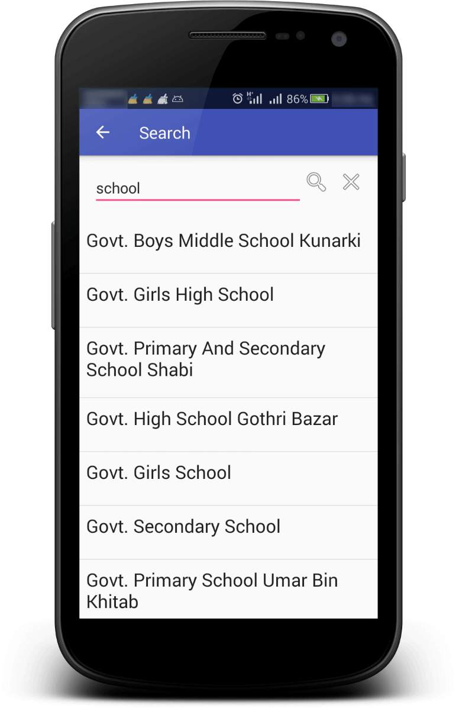

# Setup Places/Search API
To setup Places API in your application follow these steps
1. Add the following recommended gradle configuration in your root/project level `build.gradle`

``` groovy
buildscript {
  dependencies {
    classpath 'com.android.tools.build:gradle:3.5.0'
  }
}

allprojects {
repositories {
   google()
   jcenter()
   maven { url "http://api.tplmaps.com:8081/artifactory/example-repo-local/" }
}
```
> Use distributionUrl for your root/gradle/wrapper/gradle-wrapper.properties
``` groovy
distributionUrl=https://services.gradle.org/distributions/gradle-5.4.1-all.zip
```
2. Add the following gradle dependency in android application module’s `build.gradle`
``` groovy
dependencies {
  implementation 'com.tpl.maps.sdk:places:1.5.1'
}
```
3. Add Internet permission in your `AndroidManifest.xml`
``` xml
<uses-permission android:name="android.permission.INTERNET" />
```
4. Configure API Key
      - Create an account on [TPLMaps LBS Portal](https://api.tplmaps.com/apiportal).
      - In your **User Profile** menu, under **Billing**, find **API Key** Tab and [**Generate New Key**](https://api.tplmaps.com/apiportal/#/app/billing/api-key-management) from the option.
      - Copy the key put it into `<meta-data>` tag mentioned below and copy the tag in your project’s `AndroidManifest.xml` under `<application>` tag
``` xml
      <meta-data
        android:name="com.tplmaps.android.sdk.API_KEY"
        android:value="YOUR_API_KEY_HERE" />
```
5.	**Initialize Search Params** with **query** and **location** to prioritize results,
For example,
``` java
Params params = Params.builder()
                .query("restaurant")
                .location(new LngLat(33.729416, 73.038457))
                .build();
```

6. **Initialize** a local reference of `OnSearchResult` **interface** OR implement its methods to your activity class. You will get responses in their respective callback methods.

  For example,
``` java
OnSearchResult callback = new OnSearchResult() {
            @Override
            public void onSearchResult(ArrayList<Place> results) {
                for(Place place:results) {
                    Log.d(TAG, place.getName());
                }
            }

            @Override
            public void onSearchResultNotFound(Params params, long requestTimeInMS) { }

            @Override
            public void onSearchRequestFailure(Exception e) { }

            @Override
            public void onSearchRequestCancel(Params params, long requestTimeInMS) { }

            @Override
            public void onSearchRequestSuspended(String errorMessage, Params params, long requestTimeInMS) { }
        };
```
7. Pass params and `OnSearchResult` callback instance to the `SearchManager.request()` method. You will received events callbacks.
``` java
searchManager.request(params, callback);
```
> **Note:** Call SearchManager.request (String, Params) for search query after an interval of minimum 3 seconds because of network limitations applied on our servers otherwise all your request will be suspended

## API Documentation
You can find API Documentation from [here](Documentation/API/com/tplmaps/sdk/places/package-summary.html)
## Screenshot
<p float="left">
 
</p></br>


