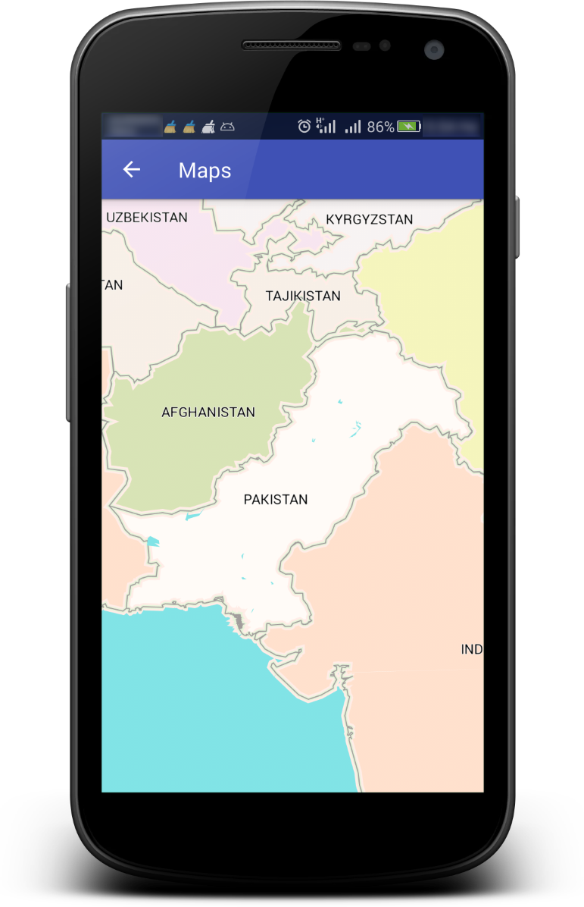
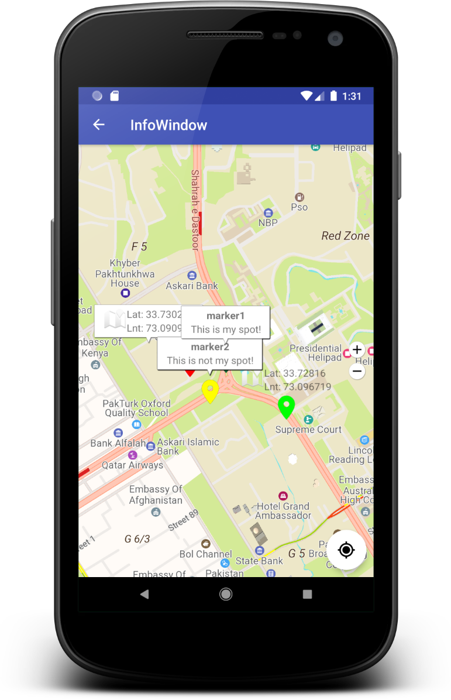
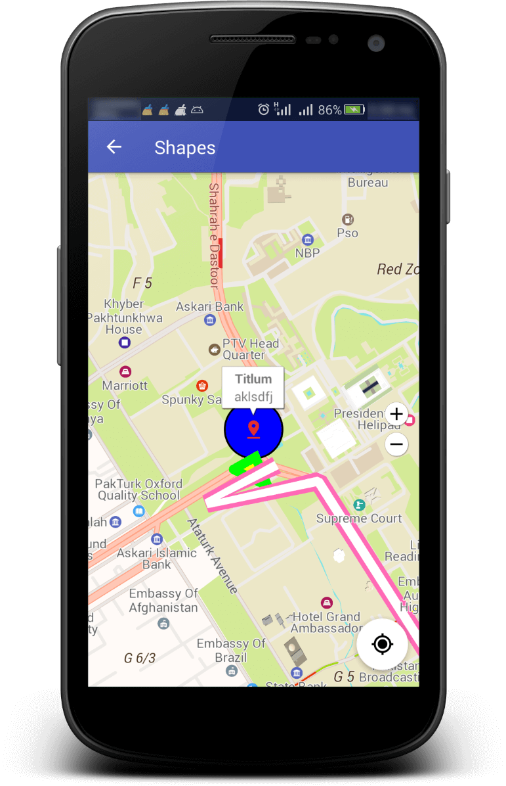
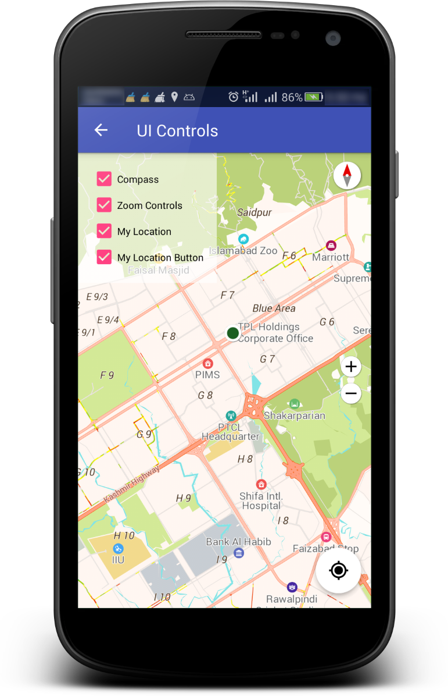
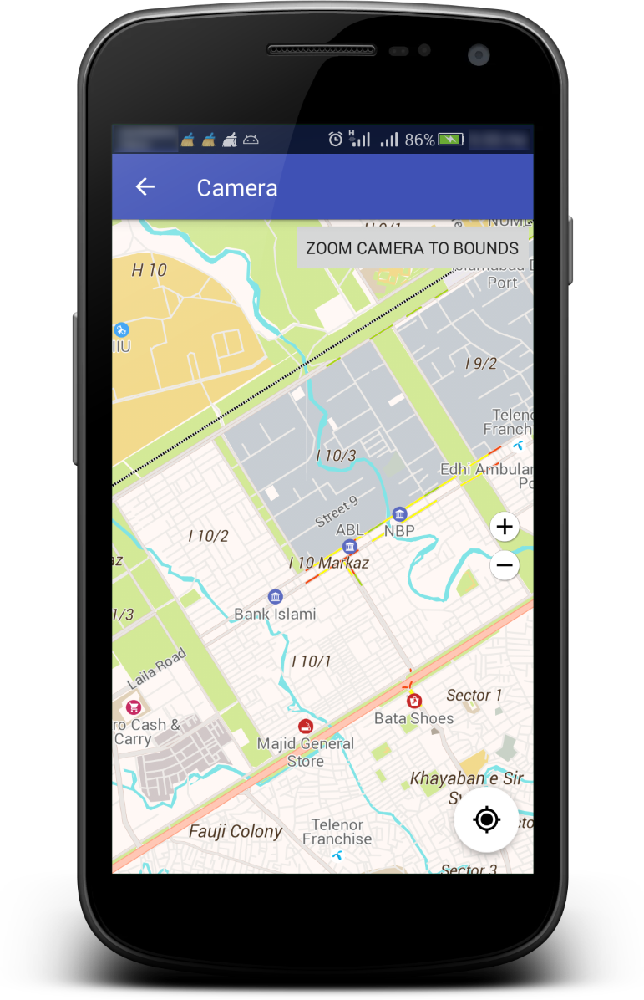
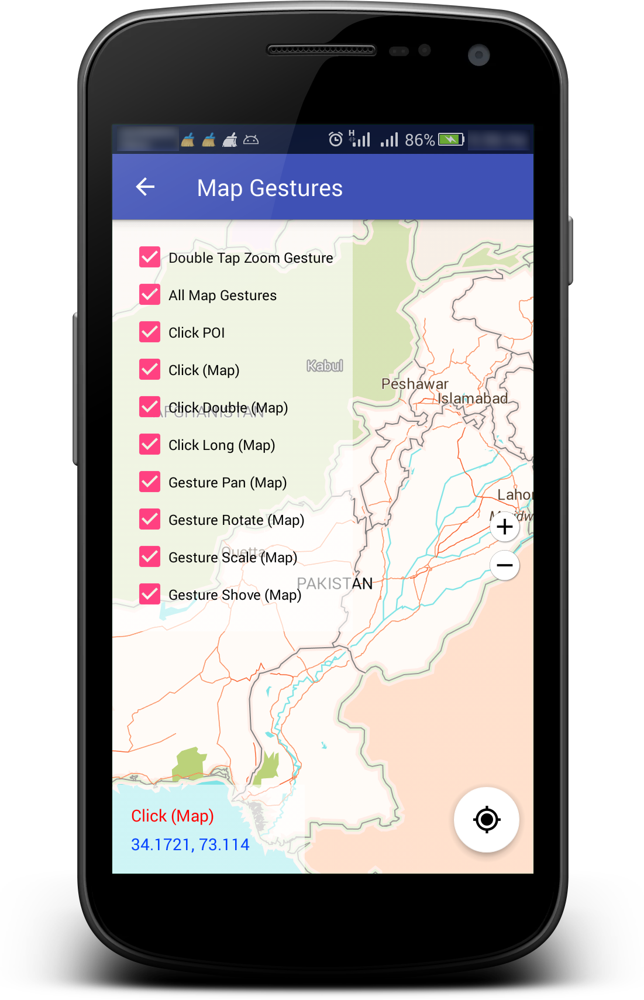
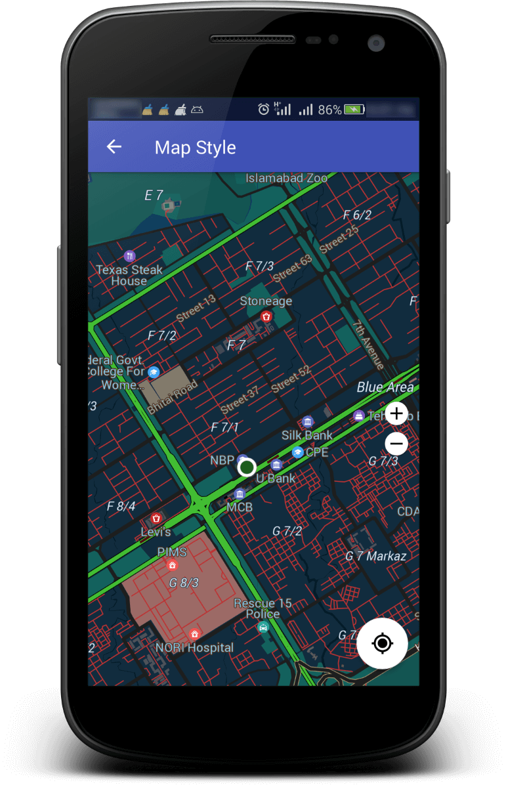

# TPL Maps Android SDK

## Overview
A Native Android SDK to integrate 3D Vector Maps, Places & Routing API in your Android Application Project.

> The project is tested on Android Studio versions 3.3, 3.3.1 & 3.4.2 - if you have issues building it, please upgrade to one of these versions.

## Content
- [Overview](https://github.com/TPLMaps/TPLMapsAndroidSdkSamples#overview) 
- [Features](https://github.com/TPLMaps/TPLMapsAndroidSdkSamples#features) 
- [Screenshot](https://github.com/TPLMaps/TPLMapsAndroidSdkSamples#screenshot) 
- [Sample APK](https://github.com/TPLMaps/TPLMapsAndroidSdkSamples#sample-apk) 
- [Developer Guide](https://github.com/TPLMaps/TPLMapsAndroidSdkSamples#developer-guide) 
- [API Documentation](https://github.com/TPLMaps/TPLMapsAndroidSdkSamples#api-documentation) 
- [Contributor](https://github.com/TPLMaps/TPLMapsAndroidSdkSamples#contributor) 
- [FAQs](https://github.com/TPLMaps/TPLMapsAndroidSdkSamples#faqs) 

## Features:
- [**Maps API**](/docs/Maps.md)
- [**Places API**](/docs/Places.md)
- [**Routing API**](/docs/Routing.md)

## Screenshot

 
  
 
 
 
 
 
 

## Sample APK
[APK](/APK/samples-debug.apk)

## Contributor
Muhammad Hassan Jamil  (Team Lead Android Development - TPL Maps - hassan.jamil@tplmaps.com)

## Developer guide
You can find a brief developer guide [here](https://api.tplmaps.com/android-doc/)

## API Documentation
You can find API Documentation from [here](https://api.tplmaps.com/apiportal/#/portal/sdk-doc)
 
## [FAQs](/docs/FAQs.md)
