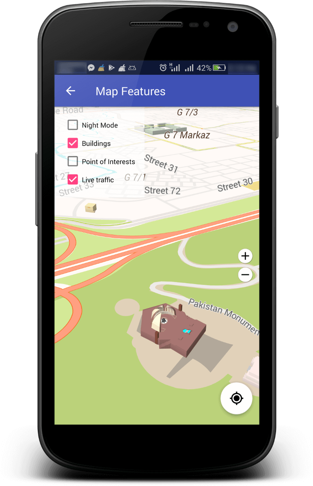
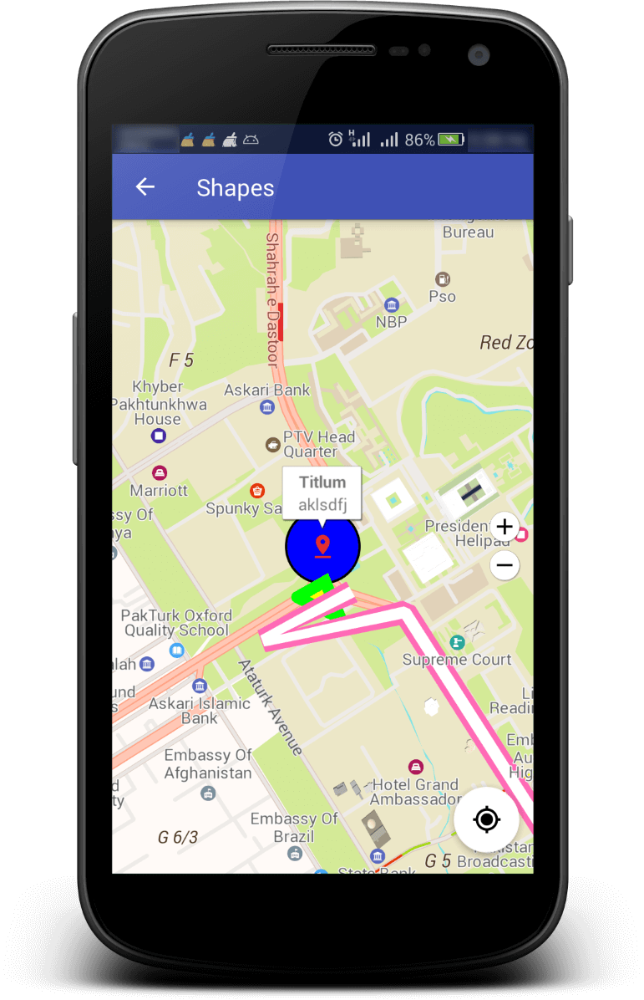
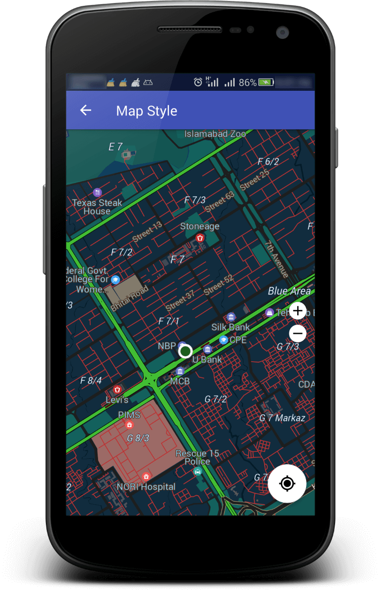

# TPL Maps Android SDK

## Table Of Content
- [Overview](#overview)
- [API Guides](#api-guides)
- [Screenshots](#screenshots)
- [Contributor](#contributor)
- [Latest Release](#latest-release)
- [API Reference](#api-reference-javadocs)
- [FAQs](#faqs)

## Overview

A Native Android SDK to integrate 3D Vector Maps, Places & Routing API in your Android Application Project.

> The project is tested on Android Studio versions 3.3, 3.3.1, 3.4.2, 3.5, 3.6 & 3.6.2 - if you have issues building it, please upgrade to one of these versions. Try this samples project with latest version of [Android Studio](https://developer.android.com/studio)

## API Guides
- [Maps API](Maps.md)
  - [Migrate from Google Maps to TPL Maps](Migrate.md)
- [Places API](Places.md)
- [Routing API](Routing.md)

## Screenshots

 
  
 
 
 
 
 
 

## Contributor
**Muhammad Hassan Jamil**  
Assistant Manager & Team Lead (Android Development)  
[TPL Maps](https://tplmaps.com/)   
hassan.jamil@tplmaps.com   

## Latest Release
Always go for [latest release](https://github.com/TPLMaps/TPLMapsAndroidSdkSamples/releases) while working with the TPL Maps Android SDK to get the more improved version, sample APK can be found with the release.

## API Reference (JavaDocs)
You can find API Reference from [here](https://api.tplmaps.com/apiportal/#/portal/sdk-doc)

## [FAQs](Faqs.md)

