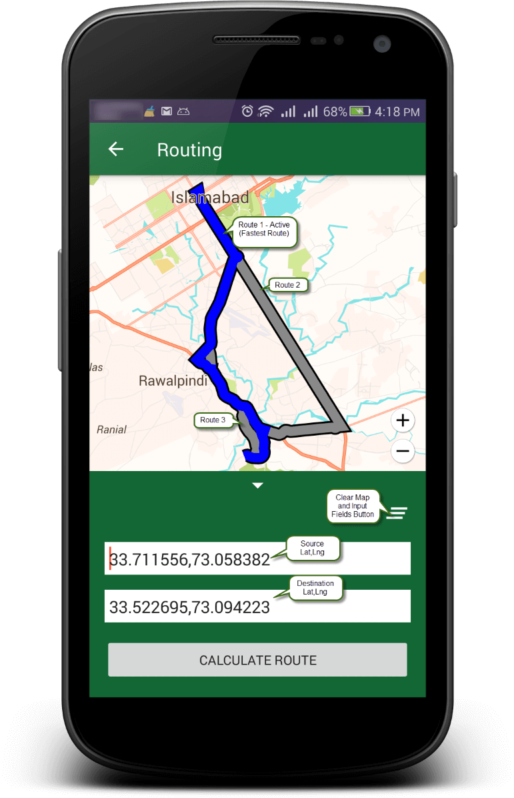

# Setup Routing API
To setup Routing API in your application follow these steps
1. Add the following **recommended gradle configuration** in your root/project level `build.gradle`
``` groovy
buildscript {
  dependencies {
    classpath 'com.android.tools.build:gradle:3.5.0'
  }
}

allprojects {
repositories {
   google()
   jcenter()
   maven { url "http://api.tplmaps.com:8081/artifactory/example-repo-local/" }
}
```
> Use **distributionUrl** for your root/gradle/wrapper/gradle-wrapper.properties
```groovy
distributionUrl=https://services.gradle.org/distributions/gradle-5.4.1-all.zip
```
2. Add the following **gradle dependency** in android application module’s `build.gradle`
``` groovy
dependencies {
  implementation 'com.tpl.maps.sdk:routing:1.6.3'
}
```
3. Add Internet **permission** in your `AndroidManifest.xml`
``` xml
<uses-permission android:name="android.permission.INTERNET" />
```
4. **Configure API key & ORIGIN**

	Create an account on [TPLMaps LBS Portal](https://api.tplmaps.com/apiportal).

	Get the Key (without **ORIGIN**), from your **Dashboard**, find **API Keys** Tab and [Generate New Key](https://api.tplmaps.com/apiportal/#/app/billing/api-key-management) from the option. 

	Copy the key put it into `meta-tag` mentioned below and copy the tag in your project’s **AndroidManifest.xml** under `<application>` tag

    ```xml
    <meta-data android:name="com.tplmaps.android.sdk.API_KEY"
               android:value="YOUR_API_KEY_HERE" />
    ```
    If you generate **API Key** with the **ORIGIN** mentioned, you must need to add the ORIGIN in **AndroidManifest.xml** in the tag mentioned below with API Key.

	> The tag below is **optional** for non-origin based API Key.

    ```xml
    <meta-data android:name="com.tplmaps.android.sdk.ORIGIN"
               android:value="YOUR_ORIGIN_HERE" />
    ```
5.	**Initialize locations array** with source and destination locations
``` java
// Initializing locations array
ArrayList<Place> locations = new ArrayList<>();
// Preparing source location
Place source = new Place();
source.setName("TPL Corp ISE Office");
source.setX(73.058382);
source.setY(33.711556);
// Preparing destination location
Place destination = new Place();
destination.setName("TPL Maps Bahria Office");
destination.setX(73.094223);
destination.setY(33.522695);
// Adding locations to the array
locations.add(source);
locations.add(destination);
```
6.	**Prepare** `TPLRouteConfig` object and pass it to `TPLRouteManager.calculate(TPLRouteConfig)` method with necessary arguments as given below, You will get list of **multiple routes** if exist between source & destination locations in `IMapRoute#onMapRoutingOverview(ArrayList<Place> endPoints, ArrayList<TPLRoute> routes)` callback.
``` java
TPLRouteConfig config = new TPLRouteConfig.Builder()
                .reRoute(false)
                .endPoints(locations)
                .heading(90)
                .build();

new TPLRouteManager().calculate(this, config, new IMapRoute() {
    @Override
    public void onMapRoutingOverview(ArrayList<Place> endPoints, ArrayList<TPLRoute>
            routes) {
         // TODO Use data from ArrayList<TPLRoute> routes
}
});
```
## API Documentation
You can find API Documentation from [here](https://api.tplmaps.com/api-documentation/com/tpl/maps/sdk/routing/package-summary.html)
## Screenshot
<p float="left">
 
</p></br>


